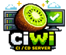

# ciwi



Simple, portable, single binary CI/CD server and agent.</br>
WIP.</br>
NOT SUITABLE FOR PUBLIC SERVERS.</br>
ONLY FOR PRIVATE NETWORKS AND HOMELAB STYLE PROJECTS.</br>

## Background

When OpenAI released Codex I decided to give it a try. In about 3 days I had a Jenkins and TeamCity alternative that worked well enough to suit some of my basic needs. In the next few weeks I'll see if becomes a project I will keep maintaining.

The nice thing about ciwi is that it's open source, free, has portable binaries of about 13MB, uses the same binary just in a different mode for agent, server or both. Memory usages is looking pretty good, with my home server instance reporting 72MB and my agents 10-21MB.

## Getting started

Check out the [automated installation scripts](#automated-installation-scripts). They set up a systemd persistent server or agent on Linux, agent service for Windows, or LaunchAgent for macOS. All of them are capable of self-updating. Go to the Global Settings ⚙️ (top-right on main page) to check for updates and roll back.

Check out the example `ciwi-project.yaml` files:
* [`ciwi-project.yaml`](https://github.com/izzyreal/cupuacu/blob/main/ciwi-project.yaml) for building and publishing cupuacu (a C++ SDL3 audio editor).
* [`ciwi-project.yaml`](ciwi-project.yaml) for building ciwi itself.

If do prefer not having the persistent server or agent that the installer scripts give you, you can run the binaries manually, giving you these options:

```bash
go run ./cmd/ciwi --help
go run ./cmd/ciwi server
go run ./cmd/ciwi agent
go run ./cmd/ciwi all-in-one
```
This comes with notably less zero-config-ness, so you'll have to read up on [environment variables](#environment-variables) below.

## Terminology

Canonical domain terminology lives in [`terminology.md`](terminology.md).

## Environment variables

Prefer the [automated installation scripts](#automated-installation-scripts), but if you wish to tinker, here are a few options:

- `CIWI_SERVER_ADDR`: server bind address (default `:8112`)
- `CIWI_DB_PATH`: sqlite database path (default `ciwi.db`)
- `CIWI_ARTIFACTS_DIR`: server artifact storage directory (default `ciwi-artifacts`)
- `CIWI_SERVER_URL`: agent target base URL (default `http://127.0.0.1:8112`)
- `CIWI_AGENT_ID`: override agent ID (default `agent-<hostname>`)
- `CIWI_AGENT_WORKDIR`: local working directory for job execution (default `.ciwi-agent`)
- `CIWI_AGENT_ENV_FILE`: Windows-only env file auto-loaded by agent startup (default `%ProgramData%\\ciwi-agent\\agent.env`)
- `CIWI_AGENT_TRACE_SHELL`: enable shell command tracing (`set -x` for `posix`, `@echo on` for `cmd`, `Set-PSDebug -Trace 1` for `powershell`) (default `true`)
- `CIWI_AGENT_GO_BUILD_VERBOSE`: sets `GOFLAGS=-v` when unset (default `true`)
- `CIWI_WINDOWS_SERVICE_NAME`: Windows service name for service mode/self-update (default `ciwi-agent`)
- `CIWI_UPDATE_REPO`: GitHub repo for update checks (default `izzyreal/ciwi`)
- `CIWI_UPDATE_API_BASE`: GitHub API base URL (default `https://api.github.com`)
- `CIWI_LOG_LEVEL`: log verbosity (`debug`, `info`, `warn`, `error`; default `info`)

Build-time version embedding:
- Version is embedded via linker flag `-X github.com/izzyreal/ciwi/internal/version.Version=<value>`.
- If not set at build time, ciwi reports `dev`.

## Server prerequisites

- `git` must be installed on the server host to import projects from git repositories.
- Project import fetches only git metadata + the root config file (no full repo checkout).
- `git` is also used by pipeline versioning (`pipelines[].versioning`) to resolve a single run version + pinned source commit.

## Agent prerequisites

- `git` must be installed on the agent host for pipeline jobs that define `source.repo`.
- `gh` must be installed on the agent host for GitHub release steps that use GitHub CLI.

## Tool capabilities and requirements

Agents automatically detect common shell tools and report versions in heartbeats:
- `git`, `go`, `gh`, `cmake`, `ninja`, `gcc`, `clang`, `xcodebuild`, `msvc`, `xorg-dev` (when present)

Use `requires.tools` in pipeline jobs to constrain tool presence/version:

```yaml
jobs:
  - id: build
    runs_on:
      os: linux
      arch: amd64
      executor: script
      shell: posix
    requires:
      tools:
        go: ">=1.24"
        git: ">=2.30"
        gh: "*"
```

Constraint syntax supports:
- presence only: `*` (or empty)
- version compare: `>=`, `>`, `<=`, `<`, `=`, `==`

From `/agents`, use **Refresh Tools** to request an on-demand re-scan on an agent.

# Automated installation scripts

## macOS agent installer (LaunchAgent)

For macOS build/signing workflows, run ciwi agent as a **LaunchAgent** (user session), not a LaunchDaemon.

One-line install (no options, tries auto-discovery first, prompts if needed):

```bash
curl -fsSL -o /tmp/install_ciwi_agent_macos.sh \
  https://raw.githubusercontent.com/izzyreal/ciwi/main/install_agent_macos.sh && \
sh /tmp/install_ciwi_agent_macos.sh
```

Install with GitHub API token (recommended to avoid rate limits):

```bash
export CIWI_GITHUB_TOKEN="<your-token>"
curl -fsSL -o /tmp/install_ciwi_agent_macos.sh \
  https://raw.githubusercontent.com/izzyreal/ciwi/main/install_agent_macos.sh && \
sh /tmp/install_ciwi_agent_macos.sh
```

Installer behavior:
- Tries mDNS/Bonjour discovery first (`_ciwi._tcp`), then falls back to probing `http://<local-ip>:8112`.
- Prefers hostname-based URLs when resolvable (for example `http://bhakti.local:8112`) and deduplicates same host seen via multiple IPs/adapters.
- If multiple servers are found, prompts you to choose one.
- If none are found, prompts for server URL.
- Installs agent binary into `~/.local/bin/ciwi` (user-writable) so self-update can swap binaries in place.
- Applies ad-hoc code signing to the installed binary (`codesign --force --sign -`) so launchd can execute updated binaries without a full signing/notarization setup.
- Stores `CIWI_GITHUB_TOKEN` in the agent LaunchAgent env when provided, and preserves existing token on reinstall if not provided.
- Installs two LaunchAgents:
  - `nl.izmar.ciwi.agent` (main agent)
  - `nl.izmar.ciwi.agent-updater` (oneshot staged updater used for self-update)
- Installs `/etc/newsyslog.d/ciwi-<user>.conf` to cap ciwi log files at 100MB (agent logs and optional server logs in `~/Library/Logs/ciwi`).

Server identity validation during install checks:
- `GET /healthz` returns `{"status":"ok"}`
- `GET /api/v1/server-info` returns `{"name":"ciwi","api_version":1,"hostname":"<host>",...}`

After install:

```bash
launchctl print gui/$(id -u)/nl.izmar.ciwi.agent
launchctl print gui/$(id -u)/nl.izmar.ciwi.agent-updater
tail -f "$HOME/Library/Logs/ciwi/agent.out.log" "$HOME/Library/Logs/ciwi/agent.err.log"
```

### macOS agent uninstall

One-line uninstall (no options):

```bash
curl -fsSL -o /tmp/uninstall_ciwi_agent_macos.sh \
  https://raw.githubusercontent.com/izzyreal/ciwi/main/uninstall_agent_macos.sh && \
sh /tmp/uninstall_ciwi_agent_macos.sh
```

Uninstaller behavior:
- Stops/unloads LaunchAgents `nl.izmar.ciwi.agent` and `nl.izmar.ciwi.agent-updater`
- Removes `~/Library/LaunchAgents/nl.izmar.ciwi.agent.plist` and `~/Library/LaunchAgents/nl.izmar.ciwi.agent-updater.plist`
- Removes ciwi binary from `~/.local/bin/ciwi` and `/usr/local/bin/ciwi` (with sudo if needed)
- Removes `/etc/newsyslog.d/ciwi-<user>.conf` (with sudo when available)
- Leaves logs/workdir by default (`~/Library/Logs/ciwi`, `~/.ciwi-agent`) and prints cleanup command

## Windows agent installer (Service)

Run from an elevated PowerShell session (Run as Administrator).

One-line install (no options):

```powershell
$script = Join-Path $env:TEMP ("install_ciwi_agent_windows_" + [Guid]::NewGuid().ToString("N") + ".ps1")
$uri = "https://raw.githubusercontent.com/izzyreal/ciwi/main/install_agent_windows.ps1?ts=$([DateTimeOffset]::UtcNow.ToUnixTimeSeconds())"
Invoke-WebRequest -Uri $uri -OutFile $script
powershell -NoProfile -ExecutionPolicy Bypass -File $script
```

Install with GitHub API token (recommended to avoid rate limits):

```powershell
$env:CIWI_GITHUB_TOKEN = "<your-token>"
$script = Join-Path $env:TEMP ("install_ciwi_agent_windows_" + [Guid]::NewGuid().ToString("N") + ".ps1")
$uri = "https://raw.githubusercontent.com/izzyreal/ciwi/main/install_agent_windows.ps1?ts=$([DateTimeOffset]::UtcNow.ToUnixTimeSeconds())"
Invoke-WebRequest -Uri $uri -OutFile $script
powershell -NoProfile -ExecutionPolicy Bypass -File $script
```

Installer behavior:
- If `CIWI_SERVER_URL` is unset, tries auto-discovery first:
- Probe step: checks `http://127.0.0.1:8112` and `http://localhost:8112`.
- Probe step: checks LAN neighbors from `arp -a` as `http://<ip>:8112`.
- Validation step: requires `GET /healthz` and `GET /api/v1/server-info` to match ciwi API identity.
- URL preference step: prefers hostname URLs when resolvable (for example `http://bhakti.local:8112`).
- If multiple servers are found, prompts you to choose one.
- If none are found, prompts for server URL.
- Downloads latest `ciwi-windows-<arch>.exe` release asset.
- Verifies SHA256 using `ciwi-checksums.txt`.
- Installs `C:\\Program Files\\ciwi\\ciwi.exe`.
- Creates/updates service `ciwi-agent` with command `"C:\\Program Files\\ciwi\\ciwi.exe agent"`.
- Writes `%ProgramData%\\ciwi-agent\\agent.env` with:
  - `CIWI_SERVER_URL`
  - `CIWI_AGENT_ID`
  - `CIWI_AGENT_WORKDIR`
  - `CIWI_LOG_LEVEL`
  - `CIWI_AGENT_TRACE_SHELL`
  - `CIWI_WINDOWS_SERVICE_NAME`
  - optional `CIWI_GITHUB_TOKEN` (preserved on reinstall if not passed)
- Starts `ciwi-agent`.

After install:

```powershell
Get-Service ciwi-agent
sc.exe qc ciwi-agent
sc.exe query ciwi-agent
```

### Windows agent uninstall

One-line uninstall (elevated PowerShell):

```powershell
$script = Join-Path $env:TEMP ("uninstall_ciwi_agent_windows_" + [Guid]::NewGuid().ToString("N") + ".ps1")
$uri = "https://raw.githubusercontent.com/izzyreal/ciwi/main/uninstall_agent_windows.ps1?ts=$([DateTimeOffset]::UtcNow.ToUnixTimeSeconds())"
Invoke-WebRequest -Uri $uri -OutFile $script
powershell -NoProfile -ExecutionPolicy Bypass -File $script
```

Uninstaller behavior:
- Stops/deletes service `ciwi-agent`.
- Removes binary `C:\\Program Files\\ciwi\\ciwi.exe`.
- Optionally removes `%ProgramData%\\ciwi-agent` (workdir/logs/config) after confirmation.

## Linux server installer (systemd)

One-line install (no options):

```bash
curl -fsSL -o /tmp/install_ciwi_server_linux.sh \
  https://raw.githubusercontent.com/izzyreal/ciwi/main/install_server_linux.sh && \
sh /tmp/install_ciwi_server_linux.sh
```

One-line uninstall (no options):

```bash
curl -fsSL -o /tmp/uninstall_ciwi_server_linux.sh \
  https://raw.githubusercontent.com/izzyreal/ciwi/main/uninstall_server_linux.sh && \
sh /tmp/uninstall_ciwi_server_linux.sh
```

Installer behavior:
- Downloads latest `ciwi-linux-<arch>` release asset.
- Verifies SHA256 using `ciwi-checksums.txt`.
- Installs `/usr/local/bin/ciwi`.
- Creates system user `ciwi` and data/log directories under `/var/lib/ciwi` and `/var/log/ciwi`.
- Installs and starts `ciwi.service` via systemd.
- Installs `ciwi-updater.service` (oneshot, root) for staged self-updates.
- Installs `/etc/polkit-1/rules.d/90-ciwi-updater.rules` so user `ciwi` can start only the updater unit.
- Installs `/etc/logrotate.d/ciwi` (rotates server logs at 100MB).

Default paths:
- Binary: `/usr/local/bin/ciwi`
- Env file: `/etc/default/ciwi`
- SQLite DB: `/var/lib/ciwi/ciwi.db`
- Artifacts: `/var/lib/ciwi/artifacts`
- Update staging: `/var/lib/ciwi/updates`
- Logs: `/var/log/ciwi/server.out.log`, `/var/log/ciwi/server.err.log`

After install:

```bash
sudo systemctl status ciwi
sudo journalctl -u ciwi -f
curl -s http://127.0.0.1:8112/healthz
```

## Linux agent installer (systemd)

One-line install (no options):

```bash
curl -fsSL -o /tmp/install_ciwi_agent_linux.sh \
  https://raw.githubusercontent.com/izzyreal/ciwi/main/install_agent_linux.sh && \
sh /tmp/install_ciwi_agent_linux.sh
```

One-line uninstall (no options):

```bash
curl -fsSL -o /tmp/uninstall_ciwi_agent_linux.sh \
  https://raw.githubusercontent.com/izzyreal/ciwi/main/uninstall_agent_linux.sh && \
sh /tmp/uninstall_ciwi_agent_linux.sh
```

Installer behavior:
- Downloads latest `ciwi-linux-<arch>` release asset.
- Verifies SHA256 using `ciwi-checksums.txt`.
- Installs `/usr/local/bin/ciwi`.
- Creates system user `ciwi-agent`.
- Installs and starts `ciwi-agent.service` via systemd.
- Installs `/etc/logrotate.d/ciwi-agent` (rotates agent logs at 100MB).
- Writes `/etc/default/ciwi-agent` with:
  - `CIWI_SERVER_URL` (default `http://127.0.0.1:8112`)
  - `CIWI_AGENT_ID`
  - `CIWI_AGENT_WORKDIR`

Default paths:
- Binary: `/usr/local/bin/ciwi`
- Env file: `/etc/default/ciwi-agent`
- Service: `ciwi-agent.service`
- Work/data: `/var/lib/ciwi-agent`
- Logs: `/var/log/ciwi-agent/agent.out.log`, `/var/log/ciwi-agent/agent.err.log`

After install:

```bash
sudo systemctl status ciwi-agent
sudo journalctl -u ciwi-agent -f
```

## Backend API

- `GET /` minimal web UI (projects/pipelines/jobs)
- `GET /projects/{projectId}` project page with structure, per-matrix run buttons and execution history
- `GET /healthz` returns `{"status":"ok"}`
- `POST /api/v1/heartbeat` accepts agent heartbeats in JSON
- `GET /api/v1/agents` returns known agents
- `POST /api/v1/agents/{agentId}/refresh-tools` requests agent tool re-scan
- `POST /api/v1/agents/{agentId}/update` requests agent update to current server version
- `POST /api/v1/projects/import` imports a project from git (`ciwi-project.yaml` by default)
- `POST /api/v1/projects/{projectId}/reload` reloads project definition from saved VCS settings
- `GET/PUT /api/v1/projects/{projectId}/vault` gets/updates project Vault settings
- `POST /api/v1/projects/{projectId}/vault-test` tests project Vault access + mapped secrets
- `POST /api/v1/jobs` enqueues a job execution
- `GET /api/v1/jobs` returns all job executions
- `GET /api/v1/jobs/{id}` returns one job execution
- `DELETE /api/v1/jobs/{id}` removes a queued/leased job execution
- `POST /api/v1/jobs/clear-queue` removes all queued/leased job executions
- `POST /api/v1/jobs/flush-history` removes all finished job executions from history
- `POST /api/v1/jobs/{id}/status` updates job execution status (`running`, `succeeded`, `failed`)
- `GET /api/v1/jobs/{id}/artifacts` lists uploaded artifacts for a job execution
- `POST /api/v1/jobs/{id}/artifacts` uploads artifacts for a job execution (agent use)
- `GET /api/v1/jobs/{id}/tests` returns parsed test report for a job execution
- `POST /api/v1/jobs/{id}/tests` uploads parsed test report for a job execution (agent use)
- `GET/POST /api/v1/vault/connections` lists/upserts Vault AppRole connections
- `DELETE /api/v1/vault/connections/{id}` deletes a Vault connection
- `POST /api/v1/vault/connections/{id}/test` tests Vault connection auth and optional read
- `POST /api/v1/agent/lease` leases a matching queued job to an agent
- `GET /api/v1/projects` returns persisted projects with pipelines
- `GET /api/v1/projects/{projectId}` returns full project structure (pipelines/jobs/matrix)
- `POST /api/v1/pipelines/run` loads `ciwi.yaml` and enqueues pipeline jobs
- `POST /api/v1/pipelines/{pipelineDbId}/run` runs a persisted pipeline from sqlite (optional `{ "dry_run": true }`)
- `POST /api/v1/pipelines/{pipelineDbId}/run-selection` runs a selected job/matrix include (optional `{ "dry_run": true }`)
- `POST /api/v1/update/check` checks latest GitHub release compatibility/version
- `POST /api/v1/update/apply` downloads latest compatible binary, starts helper, and restarts process

Pipeline configs (for example root `ciwi-project.yaml`) require:
- `pipelines[].source.repo`: git URL to clone before running job steps
- `pipelines[].source.ref` (optional): branch/tag/ref to checkout
- `pipelines[].depends_on` (optional): list of pipeline IDs that must have latest successful run before enqueue

Optional pipeline versioning:
- `pipelines[].versioning.file` (default `VERSION`): file read once per pipeline run from source checkout at a pinned commit.
- `pipelines[].versioning.tag_prefix` (default `v`): prepended to `x.y.z` from version file.
- `pipelines[].versioning.auto_bump` (`patch|minor|major`): ciwi-managed bump/push after successful run (currently requires that the run resolves to exactly one job execution).

When versioning is active, ciwi injects env vars into every job in that pipeline run:
- `CIWI_PIPELINE_VERSION_RAW` (for example `1.2.3`)
- `CIWI_PIPELINE_VERSION` / `CIWI_PIPELINE_TAG` (for example `v1.2.3`)
- `CIWI_PIPELINE_TAG_PREFIX` (for example `v`)
- `CIWI_PIPELINE_SOURCE_REF` (resolved commit SHA)
- `CIWI_PIPELINE_SOURCE_REPO`
- `CIWI_PIPELINE_VERSION_FILE`

`depends_on` pipelines inherit dependency run version/source metadata, so chained runs (for example `build -> release`) stay version-consistent end-to-end.

Config parsing uses strict YAML field validation (`KnownFields`), so unknown keys are rejected.

`steps` supports two step types:
- `run`: executes a script line in the shell defined by `runs_on.shell`.
- `test`: executes a dedicated test command and enables parsed test reports in job UI/API.
  - fields: `name` (optional), `command` (required), `format` (optional, supports `go-test-json` and `junit-xml`).

Executor model:
- `runs_on.executor` must be `script`.
- `runs_on.shell` is required when `runs_on.executor=script` and must be `posix`, `cmd`, or `powershell`.

Step-level env vars are supported:
- `steps[].env` key/value pairs are passed to the job process environment.
- Secret placeholders inside env values are resolved at lease-time:
  - `{{ secret.<name> }}`

## Vault setup (AppRole)

Vault is configured in two layers:
1. Global Vault connection (`/vault` page)
2. Per-project secret mappings (Project page -> "Vault Access")

You can also define project Vault mappings in `ciwi-project.yaml` under `project.vault`; on import/reload/load this is synced into sqlite.

### 1) Add Vault connection

Open `/vault` and create a connection with:
- `name` (e.g. `home-vault`)
- `url` (e.g. `http://bhakti.local:8200`)
- `approle_mount` (usually `approle`)
- `role_id`
- `secret_id_env` (required): name of environment variable that contains the AppRole Secret ID

Then use the **Test** button to validate AppRole login (and optional read checks through project test flow).

### 2) Configure project Vault access

Open a project page and in **Vault Access**:
- select the Vault connection
- define mappings, one per line:
  - `name=mount/path#key`
  - example: `github_secret=kv/gh#token`
- click **Save Vault Settings**
- click **Test**

### 3) Use mapped secrets in pipeline YAML

Example `ciwi-project.yaml` step:

```yaml
steps:
  - run: github-release ... --security-token "$GITHUB_SECRET"
    env:
      GITHUB_SECRET: "{{ secret.github_secret }}"
```

This references the project mapping named `github_secret`.

### Optional: define mappings in `ciwi-project.yaml`

```yaml
project:
  name: ciwi
  vault:
    connection: home-vault
    secrets:
      - name: github-secret
        mount: kv
        path: gh
        key: token
        kv_version: 2
```

## Vault security model

- Secrets are resolved **just-in-time** when an agent leases a job.
- Plaintext secret values are **not persisted** in sqlite.
- Jobs with secrets automatically disable shell trace (`set -x`) for safer logs.
- Job output streaming/final logs redact known secret values as `***`.

## Quick API test

```bash
# 1) Start server and agent in separate terminals.
go run ./cmd/ciwi server
go run ./cmd/ciwi agent

# 2) Open browser UI.
open http://127.0.0.1:8112/

# 3) Import a project from git (loads ciwi-project.yaml by default).
curl -s -X POST http://127.0.0.1:8112/api/v1/projects/import \
  -H 'Content-Type: application/json' \
  -d '{"repo_url":"https://github.com/izzyreal/ciwi.git","repo_ref":"main"}'

# 4) Find pipeline DB IDs.
curl -s http://127.0.0.1:8112/api/v1/projects

# Optional: reload an imported project definition from VCS.
curl -s -X POST http://127.0.0.1:8112/api/v1/projects/1/reload -d '{}'

# 5) Run a persisted pipeline by DB ID.
curl -s -X POST http://127.0.0.1:8112/api/v1/pipelines/1/run -d '{}'

# 6) Check jobs:
curl -s http://127.0.0.1:8112/api/v1/jobs
```

## Screenshots


