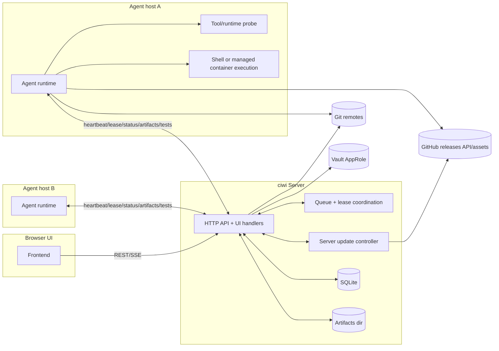
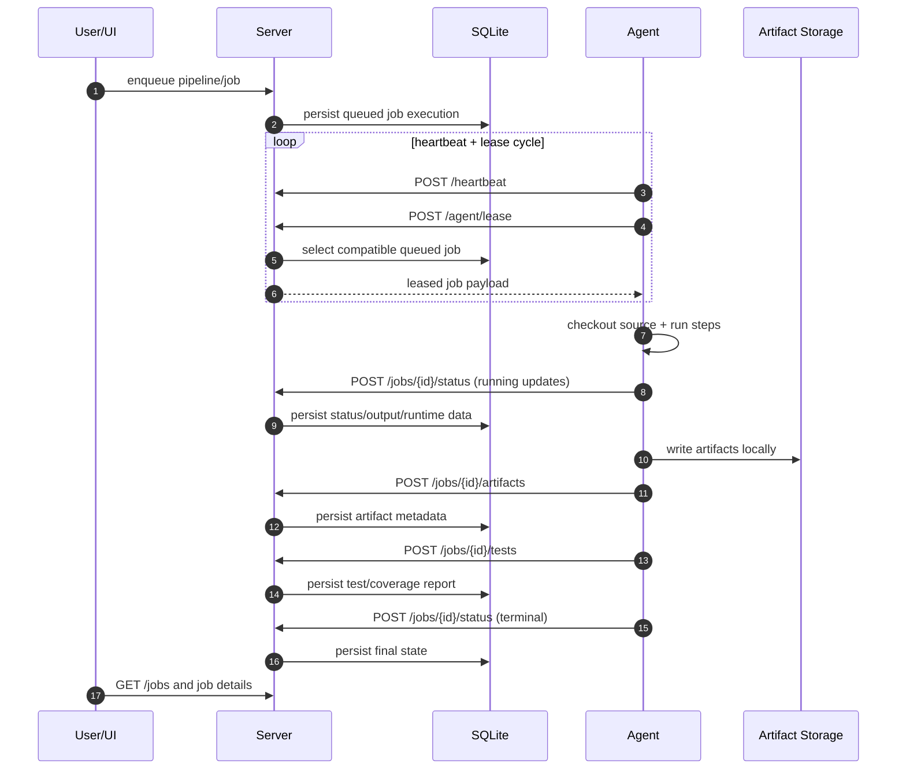
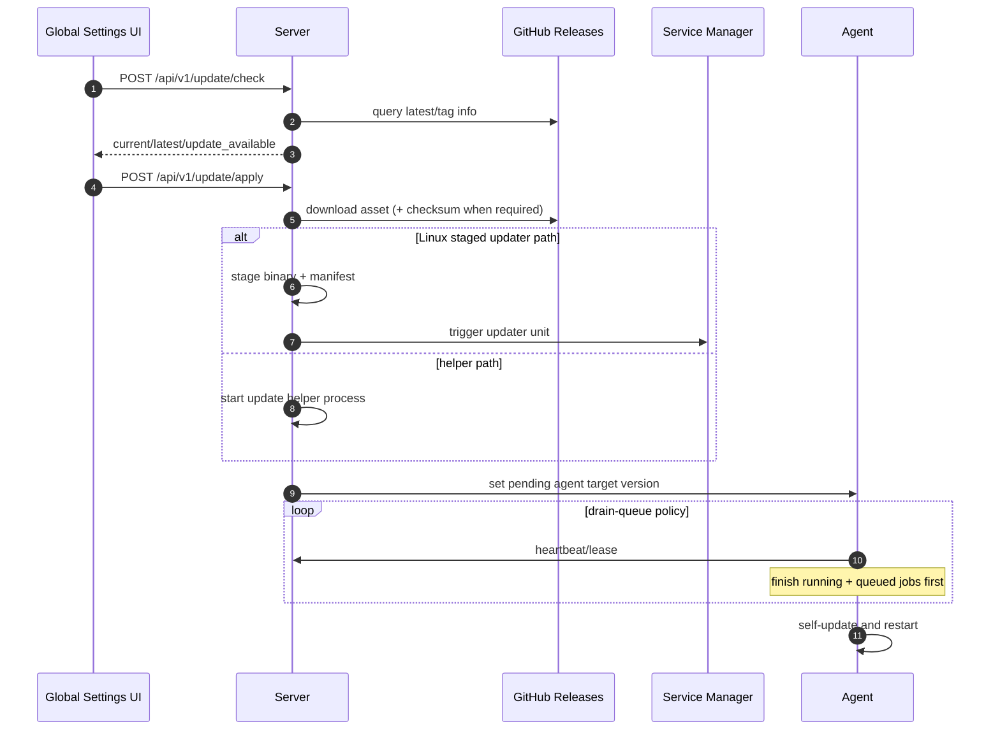

# Architecture

ciwi is a single codebase that runs in three modes:
- server
- agent
- all-in-one

It is designed for private-network CI/CD with explicit, structured contracts between components.

## High-level architecture

## Job lifecycle

## Update architecture

## Data model (conceptual)

Primary persisted entities:
- projects
- pipelines and pipeline jobs
- pipeline chains
- job executions
- job artifacts
- test/coverage reports
- app state key-values (including update status)
- vault connections + per-project vault settings

## Design principles

- Structured APIs over log scraping.
- Deterministic server-side state transitions for jobs.
- Agent capability and runtime requirement matching before execution.
- Explicit update orchestration with persisted status.

## Trust boundaries and assumptions

- Intended for private networks/homelab-style deployments.
- No claim of hard multi-tenant isolation/security hardening.
- Credentials/secrets expected to be managed through Vault mappings or host environment discipline.
