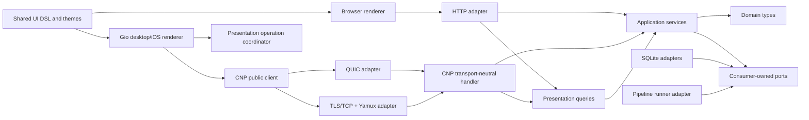
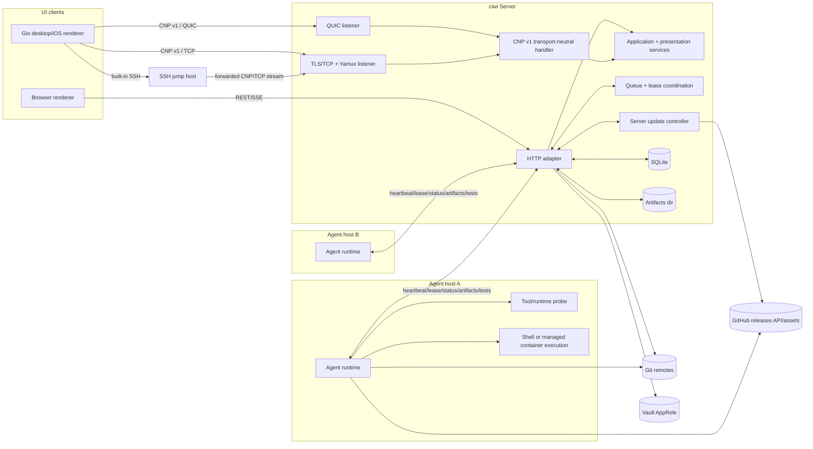
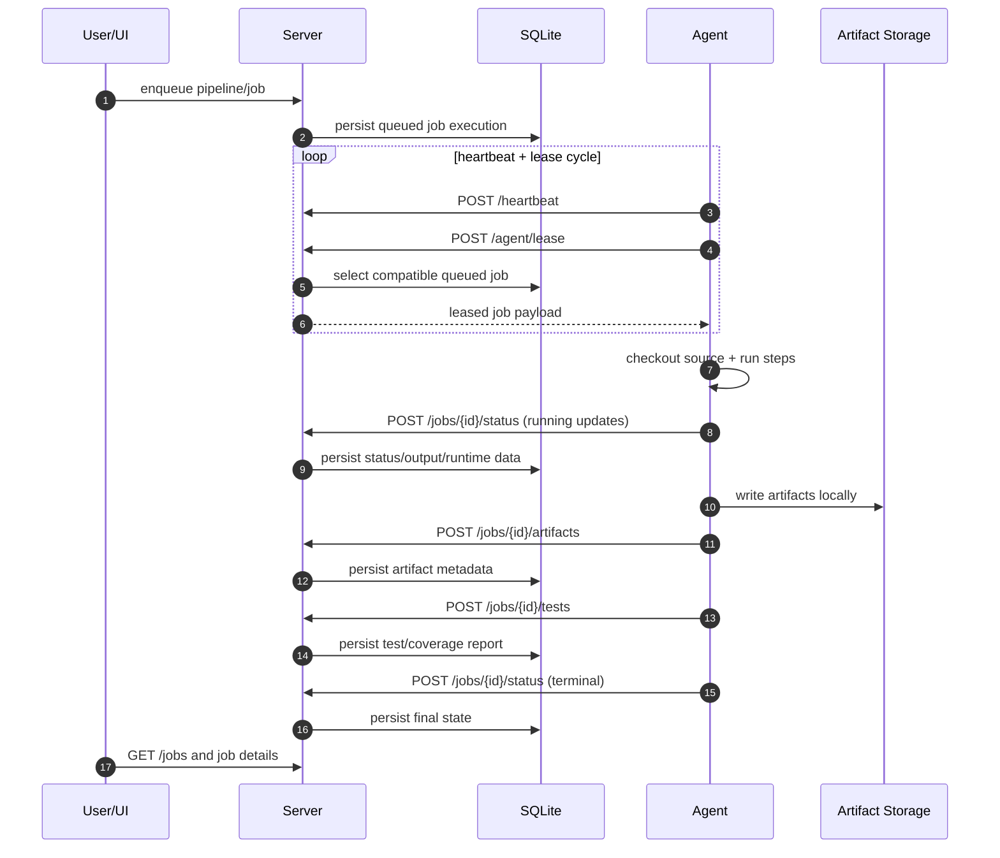
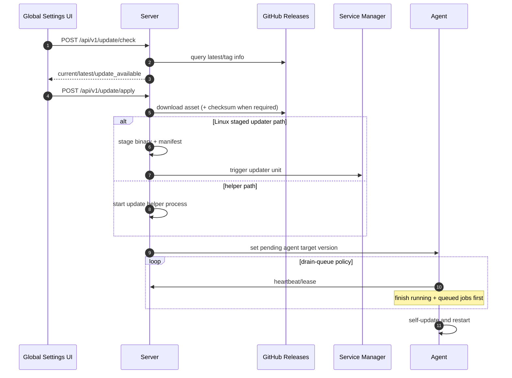

# Architecture

ciwi's service binary runs in three modes:
- server
- agent
- all-in-one

It is designed for private-network CI/CD with explicit, structured contracts
between components. A separate `ciwi-desktop` executable is the first native UI
client.

## Package architecture

```mermaid
flowchart LR
  WEB[Browser renderer] --> HTTP[HTTP adapter]
  GIO[Gio desktop/iOS renderer] --> CNPCLIENT[CNP public client]
  GIO --> OPS[Presentation operation coordinator]
  HTTP --> APP[Application services]
  CNP[CNP transport-neutral handler] --> APP
  QUIC[QUIC adapter] --> CNP
  TCP[TLS/TCP + Yamux adapter] --> CNP
  CNPCLIENT --> QUIC
  CNPCLIENT --> TCP
  APP --> DOMAIN[Domain types]
  PRES[Presentation queries] --> APP
  HTTP --> PRES
  CNP --> PRES
  APP --> PORTS[Consumer-owned ports]
  SQLITE[SQLite adapters] --> PORTS
  RUNNER[Pipeline runner adapter] --> PORTS
  DSL[Shared UI DSL and themes] --> WEB
  DSL --> GIO
```

The dependency direction is deliberate:

- `internal/domain` contains transport- and persistence-neutral concepts.
- `internal/application` owns use cases, command semantics, ports, typed
  errors, idempotency, and change invalidations.
- `internal/presentation` composes renderer-facing view models.
- `internal/presentation/operations` coordinates asynchronous user intent,
  duplicate coalescing, mutation scopes, cancellation, and durable operation
  identity without importing a renderer or transport.
- `internal/adapters` maps SQLite, the existing execution engine, native CNP
  sessions (QUIC or multiplexed TLS/TCP), and Gio to those inner contracts.
- `internal/server` is the composition root and HTTP adapter. Existing server
  behavior moves inward by vertical slice rather than by a flag-day rewrite.
- `pkg/cnp`, `pkg/cnp/v1`, and `pkg/cnpclient` are the public native protocol.
- `internal/cnptransport/tcpmux` contains the Yamux-specific stream adapter;
  Yamux is not part of CNP's public contract or application services.
- `pkg/uidsl` and `ui` are independent of HTTP, CNP, SQLite, and renderer APIs.

Architecture tests enforce the most important import boundaries. Interfaces
are normally declared by the consuming application service, not collected in a
generic global interfaces package.

### Ownership and dependency rules

| Area | Owns | Must not own |
| --- | --- | --- |
| Domain | Stable business concepts and state-transition vocabulary | Transport, persistence, rendering, or process lifecycle |
| Application | Commands, queries, authorization points, idempotency, invalidations, and consumer-owned ports | HTTP/CNP DTOs, SQLite rows, or renderer state |
| Presentation | Complete renderer-neutral labels and screen view models | Transport mapping, browser/Gio behavior, or persisted models |
| Adapters | Protocol, persistence, repository, runner, and renderer integration | Business policy duplicated from application/presentation |
| Server host | Process composition, listeners, lifecycle, and adapter registration | New business workflows or long-lived feature state |

Boundary tests inspect transitive first-party dependencies, not only direct
imports. New exceptions are not accepted silently: a dependency that cannot yet
be moved inward must be documented as migration debt and kept out of the inner
layers.

### Shared UI ownership

The browser and native clients use the following single-authority boundaries:

| Concern | Authoritative definition | Adapter-owned remainder |
| --- | --- | --- |
| Routes | `ui/routes.yaml` | Browser history and native navigation stacks |
| Screen hierarchy, copy, bindings, actions, visibility, and semantic layout | `ui/screens/*.yaml` | DOM/Gio widget mechanics and accessibility |
| Action class, pending label, conflict scope, navigation, and recovery | `ui/actions.yaml` | Mapping a command to HTTP or typed CNP operations |
| Colors, gradients, dimensions, typography, control geometry, and responsive width boundaries | `ui/themes/*.yaml`, `ui/typography.yaml`, and `ui/controls.yaml` | CSS variables or Gio drawing primitives |
| Renderer-facing business data | `internal/presentation` | Transport representation and local interaction state |
| Refresh invalidations | Screen data-source `watchTopics` | Route-specific HTTP/CNP loading and scheduling |

Data-source declarations name binding roots and the topics that invalidate
them. They deliberately do not name an abstract query: browser and native data
loading use different transports, and the former query strings had no runtime
consumer. State such as an open disclosure, graph viewport, output search,
tailing, connection preferences, and a browser dropdown portal remains local to
the renderer that implements the interaction.

The action catalog is the only command-semantic registry. Screen loading
validates every referenced command against it. Theme documents are also the
only theme registry; the browser generates theme CSS from those documents and
does not maintain a parallel JavaScript theme list or per-theme CSS blocks.

### Review snapshot: 2026-08-10

The architecture review after the shared UI and Gio DOM migrations found no
new dependency inversion in the backend. The domain/application/presentation
boundaries, transport-neutral CNP handler, transport adapters, migration
discipline, and consumer-owned ports remain intact, and the transitive import
boundary tests pass.

The review removed inactive top-level UIDSL persistence/override declarations,
non-executable data-source query names, a duplicate Go action-command registry,
duplicate browser theme registries and CSS, legacy browser selectors, and dead
preview route registrations. Shared multi-stop page and hero gradients are now
painted by both renderers. Large renderer files were divided along data
binding, DOM element, disclosure/graph, reconciliation, and browser control
boundaries. The accepted ownership and tradeoffs are recorded in
[`ADR 0002`](adr/0002-shared-ui-authority.md).

Remaining duplication is intentional at adapter boundaries: HTTP and CNP must
encode the same presentation models differently, and browser/Gio must map named
actions to different transports. Cross-adapter binding fixtures and command
coverage tests guard those seams. Interaction-heavy output buffering and
selection also have separate implementations because their lifecycle and I/O
models differ; their visible structure and command vocabulary stay shared.

A parity follow-up on 2026-08-11 moved compact and condensed breakpoints into
the shared control contract, made both renderers classify solely by width, and
removed the compact-only disclosure-navigation declaration and adapter path.
Project summaries now retain one inline disclosure behavior at every width,
while explicit project-name links remain ordinary shared navigation actions.
The same follow-up made declared dimensions outer-border-box constraints,
moved passive disclosure-chevron and placeholder color metrics into the shared
control contract, and fixed nested viewport input ordering so child disclosure
controls retain taps. Selecting execution-path nodes now changes local
selection/disclosure state without manufacturing user notifications; execution
queueing continues to use the shared bounded-notice path.

## High-level architecture

```mermaid
flowchart LR
  subgraph UI[UI clients]
    FE[Browser renderer]
    NATIVEUI[Gio desktop/iOS renderer]
  end

  subgraph ServerHost[ciwi Server]
    API[HTTP adapter]
    NATIVE[CNP v1 transport-neutral handler]
    QUIC[QUIC listener]
    TCP[TLS/TCP + Yamux listener]
    APP[Application + presentation services]
    SCHED[Queue + lease coordination]
    UPDATE[Server update controller]
    DB[(SQLite)]
    ART[(Artifacts dir)]
  end

  subgraph AgentHostA[Agent host A]
    AGENTA[Agent runtime]
    TOOLS_A[Tool/runtime probe]
    EXEC_A[Shell or managed container execution]
  end

  subgraph AgentHostB[Agent host B]
    AGENTB[Agent runtime]
  end

  GIT[(Git remotes)]
  GH[(GitHub releases API/assets)]
  VAULT[(Vault AppRole)]
  SSH[SSH jump host]

  FE -->|REST/SSE| API
  NATIVEUI -->|CNP v1 / QUIC| QUIC
  NATIVEUI -->|CNP v1 / TCP| TCP
  NATIVEUI -->|built-in SSH| SSH
  SSH -->|forwarded CNP/TCP stream| TCP
  QUIC --> NATIVE
  TCP --> NATIVE
  API --> APP
  NATIVE --> APP
  API <--> DB
  API <--> ART
  API <--> SCHED
  API <--> UPDATE

  AGENTA <--> |heartbeat/lease/status/artifacts/tests| API
  AGENTB <--> |heartbeat/lease/status/artifacts/tests| API
  AGENTA --> TOOLS_A
  AGENTA --> EXEC_A

  API --> GIT
  AGENTA --> GIT
  UPDATE --> GH
  AGENTA --> GH
  API --> VAULT
```

## Job lifecycle

```mermaid
sequenceDiagram
  autonumber
  participant U as User/UI
  participant S as Server
  participant DB as SQLite
  participant A as Agent
  participant FS as Artifact Storage

  U->>S: enqueue pipeline/job
  S->>DB: persist queued job execution

  loop heartbeat + lease cycle
    A->>S: POST /heartbeat
    A->>S: POST /agent/lease
    S->>DB: select compatible queued job
    S-->>A: leased job payload
  end

  A->>A: checkout source + run steps
  A->>S: POST /jobs/{id}/status (running updates)
  S->>DB: persist status/output/runtime data

  A->>FS: write artifacts locally
  A->>S: POST /jobs/{id}/artifacts
  S->>DB: persist artifact metadata

  A->>S: POST /jobs/{id}/tests
  S->>DB: persist test/coverage report

  A->>S: POST /jobs/{id}/status (terminal)
  S->>DB: persist final state
  U->>S: GET /jobs and job details
```

## Update architecture

```mermaid
sequenceDiagram
  autonumber
  participant UI as Global Settings UI
  participant S as Server
  participant GH as GitHub Releases
  participant SYS as Service Manager
  participant A as Agent

  UI->>S: POST /api/v1/update/check
  S->>GH: query latest/tag info
  S-->>UI: current/latest/update_available

  UI->>S: POST /api/v1/update/apply
  S->>GH: download asset (+ checksum when required)

  alt Linux staged updater path
    S->>S: stage binary + manifest
    S->>SYS: trigger updater unit
  else helper path
    S->>S: start update helper process
  end

  S->>A: set pending agent target version
  loop drain-queue policy
    A->>S: heartbeat/lease
    Note over A: finish running + queued jobs first
  end
  A->>A: self-update and restart
```

## Data model (conceptual)

Primary persisted entities:
- projects
- pipelines and pipeline jobs
- pipeline chains
- job executions
- job artifacts
- test/coverage reports
- app state key-values (including update status)
- idempotent command receipts and the stable server installation ID
- vault connections plus step-level and version auto-bump mappings from YAML

SQLite schema changes are applied by ordered, transactional migrations recorded
in `schema_migrations`. A server refuses to open a database written by a newer
schema version. Migration compatibility applies to persisted production data
even while internal Go and pre-1.0 protocol APIs continue to evolve.

## Design principles

- Structured APIs over log scraping.
- Deterministic server-side state transitions for jobs.
- Agent capability and runtime requirement matching before execution.
- Explicit update orchestration with persisted status.
- Application behavior is independent of HTTP status codes, handlers,
  protobuf messages, SQLite rows, HTML, and Gio widgets.
- Browser and native renderers share semantic screen/theme definitions while
  retaining platform-specific rendering and accessibility behavior.
- Browser and native renderers share the action catalog for pending labels,
  query supersession, mutation conflict scopes, and recovery policy; adapters
  only map a named action onto HTTP or CNP.
- Mutating commands are idempotent at the application boundary when a caller
  supplies a command key.
- A stable, database-backed server installation ID prevents a native journal
  from replaying an operation against the wrong server. Persisted command
  receipts let reconnecting clients distinguish completed, failed, pending,
  and restart-interrupted outcomes.
- Live clients receive invalidations and re-query authoritative views; event
  payloads are not a second state store.

## Evolution priorities

- Centralize execution metadata keys and typed accessors while retaining the
  map representation used by the protocol and SQLite store.
- Move pipeline version resolution, pending-job construction, preview, and
  dependency reconciliation into a focused `internal/server/pipelinerun`
  package so inspection and execution share one planning path.
- Keep the browser UI as real embedded assets owned by
  `internal/server/webui`, while the shared screens, themes, action catalog,
  fonts, and canonical logo remain in `ui`; preserve the single-binary server
  deployment model.
- Keep process-local agent snapshots, queued control requests, deactivation,
  and update-rollout scheduling owned by the agent registry. Persistence, job
  cancellation, and invalidation publication remain orchestration concerns at
  the adapter boundary. Extract the still-separate server update controller
  when that area next requires substantial changes.
- Extend the agent-owned source-checkout and script-runner ports when a concrete
  authenticated repository or new runner kind is implemented; do not introduce
  a generic repository or runner framework ahead of those requirements.
- Prefer focused packages and consumer-owned interfaces over generic model,
  service, or utility layers.
- Continue moving renderer-independent labels, semantic state, and validation
  through application/presentation slices; keep only transport representation
  and interaction state in the HTTP/browser and CNP/Gio adapters.
- Extend graph and narrow/wide interactions through the existing shared
  graph/detail declarations and width-only viewport contract without forking
  screen definitions or classifying by platform.
- Treat the shared declarative routes as the production UI contract. Add new
  browser and native behavior to the shared screen/action definitions first,
  with explicit platform overrides only when the interaction is inherently
  platform-specific.
- Keep agents on HTTP until agent transport migration has a concrete benefit;
  CNP is currently a client-facing protocol, not a forced whole-system rewrite.

## Trust boundaries and assumptions

- Intended for private networks/homelab-style deployments.
- No claim of hard multi-tenant isolation/security hardening.
- Direct CNP v1 encrypts QUIC and TCP sessions with TLS 1.3 but does not
  authenticate endpoint identity. Built-in SSH mode authenticates the jump
  host with a pinned host-key fingerprint and a device key, while the inner CNP
  endpoint retains the same v1 limitation.
- Credentials/secrets expected to be managed through Vault mappings or host environment discipline.

## Planned extension boundaries

- Human, device, agent, and system authentication belongs in transport
  adapters. Authorization and audit decisions belong at application command
  boundaries. Concrete identity providers are deferred until IAM is built.
- Repository inspection and agent checkout use focused source-provider ports.
  Credential references remain opaque to execution metadata and must never be
  logged or persisted as resolved secrets.
- Execution plans use typed step kinds and runner dispatch. Shell execution is
  the initial driver; runner-specific policy must not leak into shared planning
  or presentation models.
