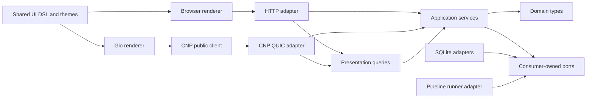
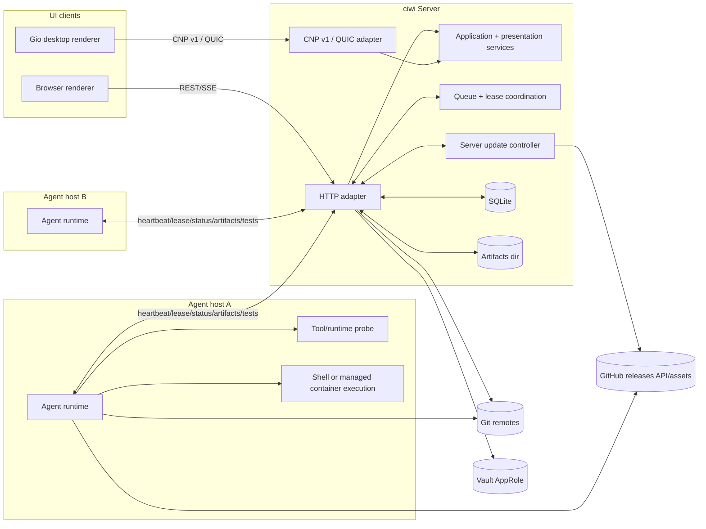
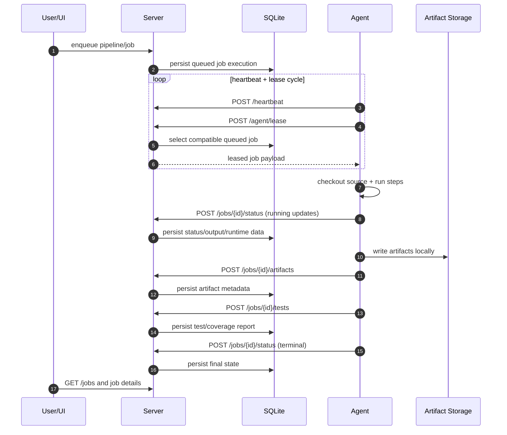
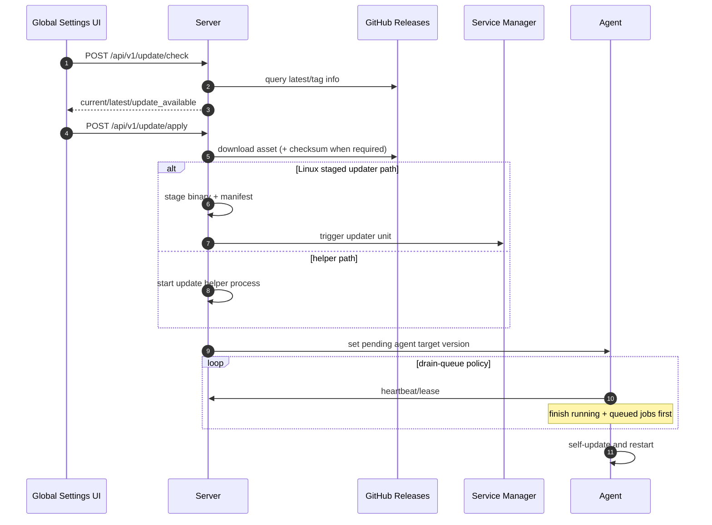

# Architecture

ciwi's service binary runs in three modes:
- server
- agent
- all-in-one

It is designed for private-network CI/CD with explicit, structured contracts
between components. A separate `ciwi-desktop` executable is the first native UI
client.

## Package architecture

```mermaid
flowchart LR
  WEB[Browser renderer] --> HTTP[HTTP adapter]
  GIO[Gio renderer] --> CNPCLIENT[CNP public client]
  HTTP --> APP[Application services]
  CNP[CNP QUIC adapter] --> APP
  CNPCLIENT --> CNP
  APP --> DOMAIN[Domain types]
  PRES[Presentation queries] --> APP
  HTTP --> PRES
  CNP --> PRES
  APP --> PORTS[Consumer-owned ports]
  SQLITE[SQLite adapters] --> PORTS
  RUNNER[Pipeline runner adapter] --> PORTS
  DSL[Shared UI DSL and themes] --> WEB
  DSL --> GIO
```

The dependency direction is deliberate:

- `internal/domain` contains transport- and persistence-neutral concepts.
- `internal/application` owns use cases, command semantics, ports, typed
  errors, idempotency, and change invalidations.
- `internal/presentation` composes renderer-facing view models.
- `internal/adapters` maps SQLite, the existing execution engine, QUIC, and Gio
  to those inner contracts.
- `internal/server` is the composition root and HTTP adapter. Existing server
  behavior moves inward by vertical slice rather than by a flag-day rewrite.
- `pkg/cnp`, `pkg/cnp/v1`, and `pkg/cnpclient` are the public native protocol.
- `pkg/uidsl` and `ui` are independent of HTTP, CNP, SQLite, and renderer APIs.

Architecture tests enforce the most important import boundaries. Interfaces
are normally declared by the consuming application service, not collected in a
generic global interfaces package.

## High-level architecture

```mermaid
flowchart LR
  subgraph UI[UI clients]
    FE[Browser renderer]
    DESKTOP[Gio desktop renderer]
  end

  subgraph ServerHost[ciwi Server]
    API[HTTP adapter]
    NATIVE[CNP v1 / QUIC adapter]
    APP[Application + presentation services]
    SCHED[Queue + lease coordination]
    UPDATE[Server update controller]
    DB[(SQLite)]
    ART[(Artifacts dir)]
  end

  subgraph AgentHostA[Agent host A]
    AGENTA[Agent runtime]
    TOOLS_A[Tool/runtime probe]
    EXEC_A[Shell or managed container execution]
  end

  subgraph AgentHostB[Agent host B]
    AGENTB[Agent runtime]
  end

  GIT[(Git remotes)]
  GH[(GitHub releases API/assets)]
  VAULT[(Vault AppRole)]

  FE -->|REST/SSE| API
  DESKTOP -->|CNP v1 / QUIC| NATIVE
  API --> APP
  NATIVE --> APP
  API <--> DB
  API <--> ART
  API <--> SCHED
  API <--> UPDATE

  AGENTA <--> |heartbeat/lease/status/artifacts/tests| API
  AGENTB <--> |heartbeat/lease/status/artifacts/tests| API
  AGENTA --> TOOLS_A
  AGENTA --> EXEC_A

  API --> GIT
  AGENTA --> GIT
  UPDATE --> GH
  AGENTA --> GH
  API --> VAULT
```

## Job lifecycle

```mermaid
sequenceDiagram
  autonumber
  participant U as User/UI
  participant S as Server
  participant DB as SQLite
  participant A as Agent
  participant FS as Artifact Storage

  U->>S: enqueue pipeline/job
  S->>DB: persist queued job execution

  loop heartbeat + lease cycle
    A->>S: POST /heartbeat
    A->>S: POST /agent/lease
    S->>DB: select compatible queued job
    S-->>A: leased job payload
  end

  A->>A: checkout source + run steps
  A->>S: POST /jobs/{id}/status (running updates)
  S->>DB: persist status/output/runtime data

  A->>FS: write artifacts locally
  A->>S: POST /jobs/{id}/artifacts
  S->>DB: persist artifact metadata

  A->>S: POST /jobs/{id}/tests
  S->>DB: persist test/coverage report

  A->>S: POST /jobs/{id}/status (terminal)
  S->>DB: persist final state
  U->>S: GET /jobs and job details
```

## Update architecture

```mermaid
sequenceDiagram
  autonumber
  participant UI as Global Settings UI
  participant S as Server
  participant GH as GitHub Releases
  participant SYS as Service Manager
  participant A as Agent

  UI->>S: POST /api/v1/update/check
  S->>GH: query latest/tag info
  S-->>UI: current/latest/update_available

  UI->>S: POST /api/v1/update/apply
  S->>GH: download asset (+ checksum when required)

  alt Linux staged updater path
    S->>S: stage binary + manifest
    S->>SYS: trigger updater unit
  else helper path
    S->>S: start update helper process
  end

  S->>A: set pending agent target version
  loop drain-queue policy
    A->>S: heartbeat/lease
    Note over A: finish running + queued jobs first
  end
  A->>A: self-update and restart
```

## Data model (conceptual)

Primary persisted entities:
- projects
- pipelines and pipeline jobs
- pipeline chains
- job executions
- job artifacts
- test/coverage reports
- app state key-values (including update status)
- vault connections + step-level vault mappings from YAML

## Design principles

- Structured APIs over log scraping.
- Deterministic server-side state transitions for jobs.
- Agent capability and runtime requirement matching before execution.
- Explicit update orchestration with persisted status.
- Application behavior is independent of HTTP status codes, handlers,
  protobuf messages, SQLite rows, HTML, and Gio widgets.
- Browser and native renderers share semantic screen/theme definitions while
  retaining platform-specific rendering and accessibility behavior.
- Mutating commands are idempotent at the application boundary when a caller
  supplies a command key.
- Live clients receive invalidations and re-query authoritative views; event
  payloads are not a second state store.

## Evolution priorities

- Centralize execution metadata keys and typed accessors while retaining the
  map representation used by the protocol and SQLite store.
- Move pipeline version resolution, pending-job construction, preview, and
  dependency reconciliation into a focused `internal/server/pipelinerun`
  package so inspection and execution share one planning path.
- Keep the browser UI as real embedded assets owned by
  `internal/server/webui`; preserve the single-binary deployment model.
- Extract agent-registry and update-controller state from the server
  composition root when those areas next require substantial changes.
- Prefer focused packages and consumer-owned interfaces over generic model,
  service, or utility layers.
- Continue moving front-page, project, job, settings, and agent behavior through
  application/presentation slices. The established browser UI remains valid
  while each declarative replacement proves behavioral parity.
- Extend the job-details snapshot/navigation slice with incremental log
  streaming, step navigation, and execution controls. Retain the established
  browser page until those behaviors reach parity.
- Keep agents on HTTP until agent transport migration has a concrete benefit;
  CNP is currently a client-facing protocol, not a forced whole-system rewrite.

## Trust boundaries and assumptions

- Intended for private networks/homelab-style deployments.
- No claim of hard multi-tenant isolation/security hardening.
- CNP v1 encrypts with QUIC TLS 1.3 but does not authenticate endpoint identity.
- Credentials/secrets expected to be managed through Vault mappings or host environment discipline.
