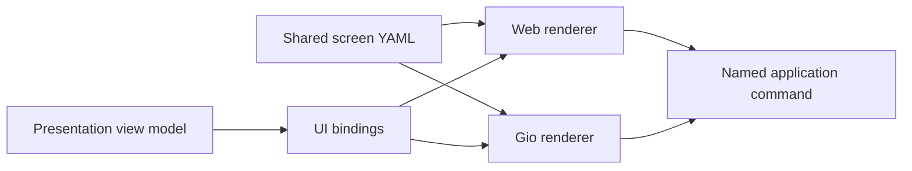

# Declarative UI contract

ciwi screens and themes can be described in a small, renderer-neutral YAML
language. It is a ciwi UI schema, not a general browser implementation.

- Parser and contract: [`pkg/uidsl`](../pkg/uidsl)
- Shared embedded bundle: [`ui`](../ui)
- Screen definitions: [`ui/screens`](../ui/screens)
- Theme definitions: [`ui/themes`](../ui/themes)
- Shared action semantics: [`ui/actions.yaml`](../ui/actions.yaml)
- Shared fonts and images: [`ui/assets`](../ui/assets)
- Gio adapter: [`internal/adapters/gio`](../internal/adapters/gio)
- Browser proof adapter: [`internal/server/webui/assets/js/declarative.js`](../internal/server/webui/assets/js/declarative.js)

Every client embeds the same versioned bundle. A native server cannot send
HTML, CSS, JavaScript, or replacement UI code to the desktop executable.

The shared bundle currently contains front-page, project-details, job-details,
run-options, agents, agent-details, agent-script, settings, managed-yaml, and
native-connection screens. Server-backed
screens render from the same presentation contracts in the browser preview and
the Gio client; local connection and SSH preferences remain renderer-owned
bindings rather than server state.

## Design boundaries

The `ciwi.ui/v1` schema contains:

- a typed component tree (`page`, `row`, `column`, `section`, `card`,
  `disclosure`, `graph-view`, `text`, `icon`, `image`, `list`, `scroller`,
  `button`, `input`, `select`, `badge`, and a small set of layout primitives);
- renderer-neutral layout and semantic style roles;
- dot-path data bindings and non-executable `{{binding}}` templates;
- repetitions and visibility conditions;
- named semantic commands with string arguments and confirmation copy;
- client/session persistence declarations;
- narrow `web`, `gio`, and compact-viewport overrides;
- semantic color, gradient, and dimension tokens.

Icons and bundled images are semantic asset names resolved by each renderer;
screen documents never contain renderer-specific vector paths or filesystem
locations. An image can alternatively bind to presentation data (for example,
a project icon conveyed as bytes over CNP and as an image endpoint in the
browser proof renderer). A style can use `toneBinding` to map execution states such as
`succeeded`, `failed`, `queued`, and `running` onto the shared semantic status
palette without duplicating status-color logic in every screen.

The `select` component binds its value and option list to view data, exposes a
renderer-neutral `selection` value to its change action, and is rendered as a
native expandable choice control or a browser `<select>` as appropriate.
The single-line `input` component similarly exposes `input.value` to a change
action. A repeated `scroller` describes a bounded horizontal collection while
leaving native gesture handling and browser overflow behavior to each adapter.
`graph-view` describes a dependency graph plus its complete list fallback;
renderers own layout, selection, pan/zoom, and local Graph/List persistence.
Disclosures can declare a renderer-neutral initial state and a templated stable
state key. Clients persist only keyed disclosure state; unkeyed disclosures
retain ordinary screen-session behavior. A disclosure may request a full-screen
sheet in compact viewports, allowing phone clients to drill into detail that is
shown inline on larger screens without duplicating the screen definition.

Ordinary non-control text, including headings, disclosure labels, and status
copy, is selectable in the Gio adapter. The semantic `code` text role renders
as a selectable read-only native editor and as a scrollable monospace region in
the browser adapter; it does not embed or execute source code. Buttons remain
native controls, so their captions follow platform control behavior rather
than document-text selection behavior.

It intentionally does not contain selectors, arbitrary CSS properties, DOM
APIs, Gio types, scripts, URLs to executable resources, protobuf messages, or
transport calls. Renderer adapters own focus, accessibility, text selection,
native widgets, dialogs, scrolling, and platform conventions.

YAML decoding uses strict known-field validation. Documents also reject unknown
components and commands, duplicate node IDs, malformed repeats, ambiguous text
expressions, missing theme tokens, and invalid gradients.

## Data and action flow

Bindings consume presentation view models, not storage rows or transport DTOs.

Time-based execution progress uses a narrow `progress.binding` node property.
The binding resolves to the shared semantic progress snapshot produced by the
presentation layer; renderers own animation and paint only. This keeps duration
estimation and aggregate weighting out of YAML, JavaScript, and Gio widgets.
Actions are resolved by each transport adapter into the same application
command. This keeps cosmetic parity practical without requiring the native
client to parse HTML/CSS or run JavaScript.

An icon can use `pulse.binding` with a Unix-millisecond event timestamp, such
as the most recent agent heartbeat. Renderers own the opacity animation. As
with progress, the screen never implements a timer or infers state from text.

`ui/actions.yaml` is the renderer-neutral action catalog. It classifies each
named command as local, query, or mutation and defines its conflict scope,
pending label, navigation behavior, and recovery policy. Renderers do not
invent these semantics independently. The browser action runner and native
operation coordinator both use the catalog to coalesce exact duplicate input,
supersede stale queries, reject conflicting mutations, expose immediate busy
state, and attach one stable idempotency key to each mutation.

The catalog deliberately does not describe HTTP routes, CNP messages, widgets,
timeouts, or animation. Those remain adapter policy. Mutation recovery is
similarly conservative: the native journal binds operations to a stable server
installation identity and only replays catalogued safe operations after it has
checked the server's command receipt. Receipt-only operations retain enough
identity to diagnose an unknown outcome but never persist sensitive or unsafe
arguments for automatic replay.

Both adapters present catalogued operation outcomes as bounded transient
notices using shared semantic theme tones. Notices are presentation feedback,
not a durable state channel; clients still re-query authoritative views after
changes.

## Compatibility policy

The `apiVersion` is mandatory. Additive optional fields can remain within
`ciwi.ui/v1`; incompatible semantic changes require a new version. Both
renderers should be tested against the same fixtures before a screen replaces
hand-authored production UI.
