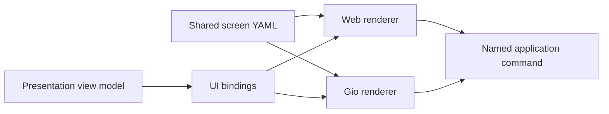

# Declarative UI contract

ciwi screens and themes can be described in a small, renderer-neutral YAML
language. It is a ciwi UI schema, not a general browser implementation.

- Parser and contract: [`pkg/uidsl`](../pkg/uidsl)
- Shared embedded bundle: [`ui`](../ui)
- Screen definitions: [`ui/screens`](../ui/screens)
- Theme definitions: [`ui/themes`](../ui/themes)
- Shared action semantics: [`ui/actions.yaml`](../ui/actions.yaml)
- Shared fonts and images: [`ui/assets`](../ui/assets)
- Gio adapter: [`internal/adapters/gio`](../internal/adapters/gio)
- Browser adapter: [`internal/server/webui`](../internal/server/webui)

Every client embeds the same versioned bundle. A native server cannot send
HTML, CSS, JavaScript, or replacement UI code to the desktop executable.

The shared bundle contains every browser and native screen, including Vault,
plus the route catalog in `ui/routes.yaml`. Public browser routes and native
navigation resolve through that catalog. Server-backed screens render from the
same presentation contracts in the browser and Gio client; local connection
and SSH preferences remain renderer-owned bindings rather than server state.

## Design boundaries

The `ciwi.ui/v1` schema contains:

- a typed component tree (`page`, `row`, `column`, `section`, `card`,
  `disclosure`, `graph-view`, `tree-view`, `text`, `icon`, `image`, `list`, `scroller`,
  `button`, `input`, `select`, `badge`, and a small set of layout primitives);
- renderer-neutral layout and semantic style roles;
- dot-path data bindings and non-executable `{{binding}}` templates;
- repetitions and visibility conditions;
- named semantic commands with string arguments and confirmation copy;
- data-source binding roots and topic-scoped refresh invalidations;
- narrow node-level `web`, `gio`, and compact-viewport overrides;
- semantic color, gradient, dimension, control, and viewport-breakpoint tokens.

Icons and bundled images are semantic asset names resolved by each renderer;
screen documents never contain renderer-specific vector paths or filesystem
locations. An image can alternatively bind to presentation data (for example,
a project icon conveyed as bytes over CNP and as an image endpoint in the
browser renderer). A style can use `toneBinding` to map execution states such as
`succeeded`, `failed`, `queued`, and `running` onto the shared semantic status
palette without duplicating status-color logic in every screen.

Typography families and control geometry are shared contracts as well. Font
families declare their browser fallback list and native Gio typeface name,
while button metrics carry explicit web and native values where the two layout
engines require different numbers to produce the same visual result. Both
renderers load the actual Geist Sans and Geist Mono faces from `ui/assets`.
The same `ui/controls.yaml` document defines compact and condensed-disclosure
maximum widths. Browsers interpret those values as CSS pixels and Gio as dp;
classification depends only on available width, never on operating system,
device type, or orientation. It also owns input placeholder color and passive
disclosure-chevron geometry, so neither adapter needs a local visual default.
Declared minimum and maximum dimensions describe the complete border box;
renderer-owned padding and borders must fit inside those dimensions.

The `select` component binds its value and option list to view data, exposes a
renderer-neutral `selection` value to its change action, and is rendered as a
native expandable choice control or an accessible browser popup control as
appropriate. Trigger height, menu padding/gaps/bounds, option height/padding,
and selection-indicator geometry all come from `ui/controls.yaml`. Each
renderer owns one active select popup: opening another transfers ownership and
closes the previous popup. A popup sizes intrinsically to the widest option or
trigger, subject to its shared minimum and viewport cap, and any pointer press
outside its trigger and menu dismisses it without consuming the target click.
The single-line `input` component similarly exposes `input.value` to a change
action. A repeated `scroller` describes a bounded collection in its declared
direction while leaving native gesture handling and browser overflow mechanics
to each adapter. Nested vertical scrollers consume available movement first and
chain movement to the page at either boundary. Their gesture observers remain
behind child controls until a tap becomes a drag, so an entire disclosure
summary remains activatable even when it is inside a nested scroller.
`graph-view` describes a dependency graph plus its complete list fallback;
renderers own layout, selection, pan/zoom, and local Graph/List persistence.
`tree-view` describes recursive report data with stable keys, disclosure state,
optional links, filtering metadata, and named node actions. Artifact, test, and
coverage hierarchies therefore remain presentation data instead of being
rebuilt independently by JavaScript and Gio.
Disclosures can declare a renderer-neutral initial state and a templated stable
state key. Clients persist only keyed disclosure state; unkeyed disclosures
retain ordinary screen-session behavior. Narrow viewports render the same
disclosure hierarchy with responsive reflow. A disclosure summary always
expands or collapses inline; an explicitly linked child such as a project name
still navigates without changing the surrounding disclosure.

Ordinary non-control text, including headings, disclosure labels, and status
copy, is passive in the Gio adapter so a touch drag that starts on its glyphs
scrolls the containing viewport. The semantic `code` text role renders as a
selectable read-only native editor and as a scrollable monospace region in the
browser adapter; it does not embed or execute source code. Buttons remain native
controls, so their captions follow platform interaction behavior rather than
document-text selection behavior, while their dimensions, icon placement, and
typography come from the shared control contract.

It intentionally does not contain selectors, arbitrary CSS properties, DOM
APIs, Gio types, scripts, URLs to executable resources, protobuf messages, or
transport calls. Renderer adapters own focus, accessibility, text selection,
native widgets, dialogs, scrolling, and platform conventions.

Persistence of renderer interaction state is intentionally not a top-level DSL
facility. The declaration supplies stable keys where cross-render persistence
is meaningful; each adapter owns its storage and lifecycle. Action recovery is
a separate concern described by the action catalog's `persistence` policy.

Data sources similarly do not prescribe transport queries. Their names define
the roots available to bindings, and `watchTopics` define invalidation
interest. Route-specific loaders remain explicit in the HTTP/browser and
CNP/Gio adapters, where request parameters, cancellation, streaming, and local
connection state can be handled without a false renderer-neutral query layer.

YAML decoding uses strict known-field validation. Documents also reject unknown
components, duplicate node IDs, malformed repeats, ambiguous text
expressions, missing theme tokens, and invalid gradients.
The shared bundle validates every screen command against `ui/actions.yaml`, so
the catalog—not a second Go list—is authoritative.
`uidsl.ValidateBindings` additionally checks concrete view models—including
repeat and select items—before Gio renders them; equivalent browser fixtures
guard the web adapter's decorated view models.

## Data and action flow

Bindings consume presentation view models, not storage rows or transport DTOs.

Time-based execution progress uses a narrow `progress.binding` node property.
The binding resolves to the shared semantic progress snapshot produced by the
presentation layer; renderers own animation and paint only. This keeps duration
estimation and aggregate weighting out of YAML, JavaScript, and Gio widgets.
Actions are resolved by each transport adapter into the same application
command. This keeps cosmetic parity practical without requiring the native
client to parse HTML/CSS or run JavaScript.

An icon can use `pulse.binding` with a Unix-millisecond event timestamp, such
as the most recent agent heartbeat. Renderers own the opacity animation. As
with progress, the screen never implements a timer or infers state from text.

`ui/actions.yaml` is the renderer-neutral action catalog. It classifies each
named command as local, query, or mutation and defines its conflict scope,
pending label, navigation behavior, and recovery policy. Renderers do not
invent these semantics independently. The browser action runner and native
operation coordinator both use the catalog to coalesce exact duplicate input,
supersede stale queries, reject conflicting mutations, expose immediate busy
state, and attach one stable idempotency key to each mutation.

The catalog deliberately does not describe HTTP routes, CNP messages, widgets,
timeouts, or animation. Those remain adapter policy. Mutation recovery is
similarly conservative: the native journal binds operations to a stable server
installation identity and only replays catalogued safe operations after it has
checked the server's command receipt. Receipt-only operations retain enough
identity to diagnose an unknown outcome but never persist sensitive or unsafe
arguments for automatic replay.

Both adapters re-query authoritative views after changes. Gio consumes the CNP
change stream and the browser consumes `/api/v1/ui/changes`; each screen's
declared `watchTopics` determines which invalidations trigger a refresh.

Theme documents are parsed by both renderers. Gio converts their semantic
tokens to drawing primitives; the browser generates `/ui/css/themes.css` from
the same documents and layers only renderer-specific derived variables on top.
Adding a theme therefore requires no JavaScript registry or hand-authored CSS
selector.

## Compatibility policy

The `apiVersion` is mandatory. Additive optional fields can remain within
`ciwi.ui/v1`; incompatible semantic changes require a new version. Both
renderers should be tested against the same fixtures before a contract change
is accepted.
