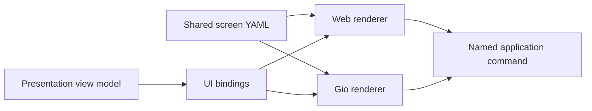

# Declarative UI contract

ciwi screens and themes can be described in a small, renderer-neutral YAML
language. It is a ciwi UI schema, not a general browser implementation.

- Parser and contract: [`pkg/uidsl`](../pkg/uidsl)
- Shared embedded bundle: [`ui`](../ui)
- Screen definitions: [`ui/screens`](../ui/screens)
- Theme definitions: [`ui/themes`](../ui/themes)
- Gio adapter: [`internal/adapters/gio`](../internal/adapters/gio)
- Browser proof adapter: [`internal/server/webui/assets/js/declarative.js`](../internal/server/webui/assets/js/declarative.js)

Every client embeds the same versioned bundle. A native server cannot send
HTML, CSS, JavaScript, or replacement UI code to the desktop executable.

The shared bundle currently contains front-page, project-details, and
job-details screens. All three render from the same presentation contracts in
the browser preview and the Gio desktop client.

## Design boundaries

The `ciwi.ui/v1` schema contains:

- a typed component tree (`page`, `row`, `column`, `section`, `card`,
  `disclosure`, `text`, `list`, `button`, and a small set of primitives);
- renderer-neutral layout and semantic style roles;
- dot-path data bindings and non-executable `{{binding}}` templates;
- repetitions and visibility conditions;
- named semantic commands with string arguments and confirmation copy;
- client/session persistence declarations;
- narrow `web` and `gio` overrides;
- semantic color, gradient, and dimension tokens.

The semantic `code` text role renders as a selectable read-only native editor
and as a scrollable monospace region in the browser adapter; it does not embed
or execute source code.

It intentionally does not contain selectors, arbitrary CSS properties, DOM
APIs, Gio types, scripts, URLs to executable resources, protobuf messages, or
transport calls. Renderer adapters own focus, accessibility, text selection,
native widgets, dialogs, scrolling, and platform conventions.

YAML decoding uses strict known-field validation. Documents also reject unknown
components and commands, duplicate node IDs, malformed repeats, ambiguous text
expressions, missing theme tokens, and invalid gradients.

## Data and action flow

Bindings consume presentation view models, not storage rows or transport DTOs.
Actions are resolved by each transport adapter into the same application
command. This keeps cosmetic parity practical without requiring the native
client to parse HTML/CSS or run JavaScript.

## Compatibility policy

The `apiVersion` is mandatory. Additive optional fields can remain within
`ciwi.ui/v1`; incompatible semantic changes require a new version. Both
renderers should be tested against the same fixtures before a screen replaces
hand-authored production UI.
